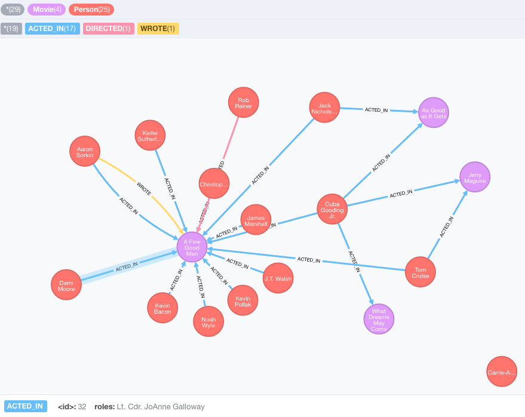
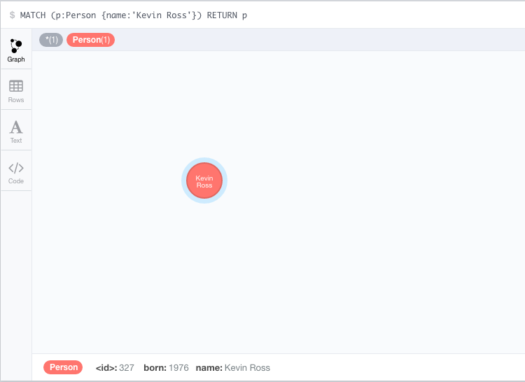
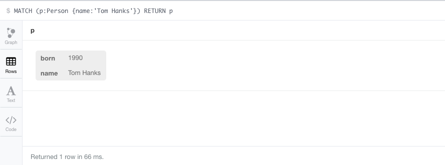

### Introduction

Neo4j-PHP-OGM is an Object Graph Mapper for Neo4j in PHP.

It uses the RepositoryPattern and is very similar to the Doctrine2 ORM, also it makes uses of Doctrine Annotations and Collection library.

### Getting started - the Neo4j Movies Example

This getting started guide is based on the Neo4j movies example you can load by running the `:play movies` in the neo4j browser.

#### Installation

Require the OGM via composer :

```bash
composer require graphaware/neo4j-php-ogm:^1.0@beta
```

### Domain identification

Let's take a look at the movie graph and define what our domain objects will look like :



We can identify the following entities :

* a **Person** having a `name` and `born` properties
* a **Movie** having a `title`, `tagline` and `release` properties

Also, the following relationships can be identified :

a `Person` acted in a `Movie`
a `Person` wrote a `Movie`


### Mapping definition

Mapping definition is done by using **Annotations** on your domain object entities, let's build the Person model :

```php
<?php

namespace Movies;

use GraphAware\Neo4j\OGM\Annotations as OGM;

/**
 * @OGM\Node(label="Person")
 */
class Person
{
    /**
     * @OGM\GraphId()
     * @var int
     */
    protected $id;

    /**
     * @OGM\Property(type="string")
     * @var string
     */
    protected $name;

    /**
     * @OGM\Property(type="born")
     * @var int
     */
    protected $born;

    /**
     * @return int
     */
    public function getId()
    {
        return $this->id;
    }

    /**
     * @return string
     */
    public function getName()
    {
        return $this->name;
    }

    /**
     * @return int
     */
    public function getBorn()
    {
        return $this->born;
    }
}
```

##### Node

First off, you'll need to import the `GraphAware\Neo4j\OGM\Annotations` directory with the `use` statement.

Secondly, you'll need to declare your model as a graph entity, by adding the `@OGM\Node()` annotation on the class.

The `@OGM\Node()` annotation must contain the name of the label representing the person nodes in the database.


##### GraphId

The `@OGM\GraphId` annotation defines the property on which the internal neo4j node id will be mapped. This property and annotation
is mandatory.

As of now, the only allowed property name is `id`, in the future you'll be able to specify a custom property name.

##### Property

The `@OGM\Property` annotation defines which entity properties will be managed by the OGM. You can have properties without this
annotation and they will not be saved / loaded to / from the database.

The type argument defines the internal type (php) of the property, common types are `string`, 'int', `float`, ...

Currently, the exact property name used in your domain model is used as property key on the database node. (This will evolve).

### Entity Manager

As of now, we are able to load / save `Person` entities to the database, as well as handling updates. Before we need to create
the entity manager which will be the central point of operations.

Creating the manager is just instantiating a new `GraphAware\Neo4j\OGM\Manager` object and passing your neo4j host url :

```php
use GraphAware\Neo4j\OGM\Manager;

$manager = Manager::create('http://localhost:7474');
```

#### Repository

Finding nodes from the database is done via their repository, retrieving the corresponding repository is done by passing the
entity class name to the `getRepository` method :

```php
use GraphAware\Neo4j\OGM\Manager;
use Movies\Person;

$manager = Manager::create('http://localhost:7474');

$personRepository = $manager->getRepository(Person::class);
```

Once you have the repository, you can retrieve node from the database, let's find `Tom Hanks` :

```php
use GraphAware\Neo4j\OGM\Manager;
use Movies\Person;

$manager = Manager::create('http://localhost:7474');

$personRepository = $manager->getRepository(Person::class);
$tomHanks = $personRepository->findOneBy('name', 'Tom Hanks');
```

The available methods on the repository are :

* `findAll()`
* `findOneBy($propertyKey, $propertyValue)`
* `findBy($property, $propertyValue)`
* `findOneById($id)`

#### Persisting new objects

Persistence is handled by the OGM with two main methods, `persist()` and `flush()`.

To briefly summarize the difference, the objects you pass to the `persist` method become `managed` by the Entity Manager,
keeping track of their changes and reflecting the changes at the next `flush()` operation.

Let's create a new actor, named `Kevin Ross` and born in `1976` :

```php
$actor = new Person('Kevin Ross', 1976);
$manager->persist($actor);
$manager->flush();
```

And verify our database :



The entity remains to be managed by the Entity Manager, this means that any update to your object will be reflected on next flush.
This is also the case when you load entities from the database, they become automtically managed, let's modify Tom Hank's year of birth :

```php
// adding the setter to the model

    /**
     * @param int $year
     */
    public function setBorn($year)
    {
        $this->born = $year;
    }
```

```php
$tomHanks->setBorn(1990);
$manager->flush();
```



He is quite younger now :)

